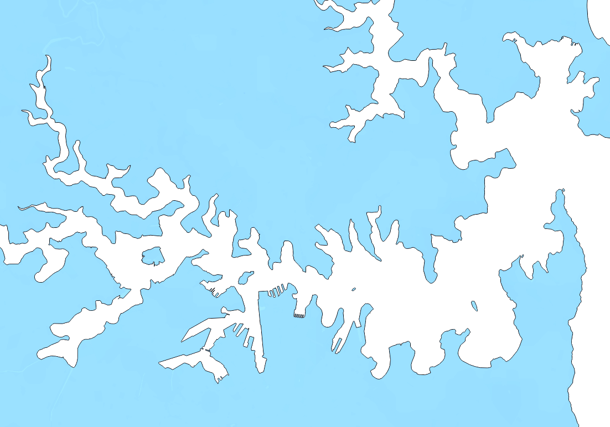
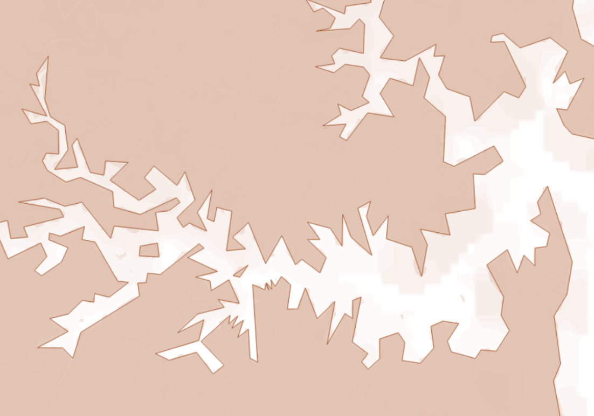
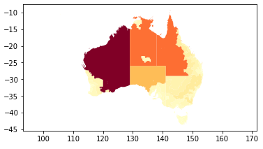
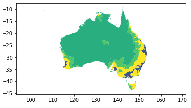
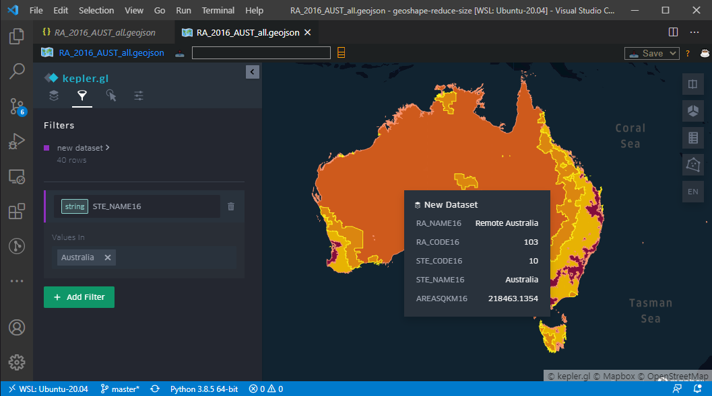

# Geo processing

## Reduce size of Shape File

For a map embedded in a high level dashboard viewed at low resolution, there is no need for great detail on map borders. The file size of a GeoJSON can be very large and slow down page load performance.

### Setup

Requires [uv](https://docs.astral.sh/uv/). Install dependencies:

```sh
uv sync
```

### Configuration

Paths are managed in [`config.yaml`](config.yaml). Update these to match your local data location before running:

```yaml
paths:
  raw_shapefile: "/path/to/RA_2016_AUST.shp"
  geojson_output: "/path/to/RA_2016_AUST.geojson"
  simplified_geojson: "data/RA_2016_AUST-simple.geojson"
  dissolved_geojson: "data/RA_2016_AUST_all.geojson"
```

Download the source shapefile from the [ABS](https://www.abs.gov.au/AUSSTATS/abs@.nsf/DetailsPage/1270.0.55.005July%202016?OpenDocument).

### Usage

**1. Convert** the shapefile to GeoJSON:

```sh
uv run convert
```

**2. Simplify** the GeoJSON using [mapshaper](https://github.com/mbloch/mapshaper) (Node.js):

```sh
mapshaper <geojson_output> -simplify dp 1% keep-shapes -o format=geojson data/RA_2016_AUST-simple.geojson
```

**3. Dissolve** state boundaries to produce national remoteness areas:

```sh
uv run dissolve
```

### Result





---

## Dissolve state boundaries

The Remoteness Area boundaries are provided by state. This step dissolves those state boundaries to produce a single national feature per remoteness category.

A sample of the input properties:

```json
{
  "properties": {
    "RA_CODE16": "11",
    "RA_NAME16": "Inner Regional Australia",
    "STE_CODE16": "1",
    "STE_NAME16": "New South Wales",
    "AREASQKM16": 87424.8418
  }
}
```

### With state boundaries



### Without state boundaries



---

## Interacting with geospatial data

[VSCode Geo Data Viewer plugin](https://github.com/RandomFractals/geo-data-viewer)


