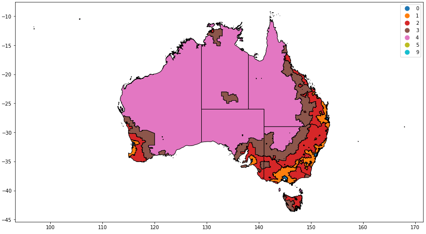
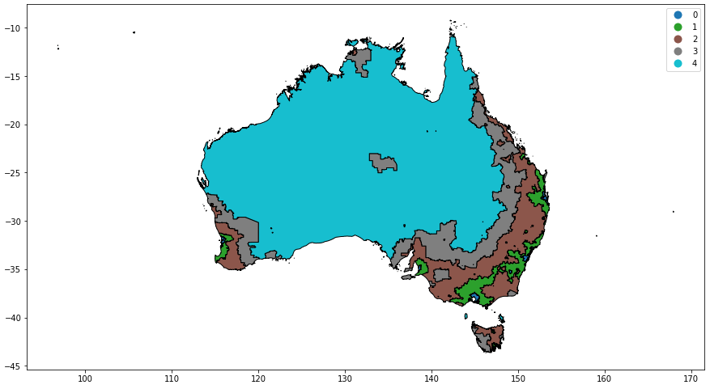

# Geo processing

## Reduce size of Shape File

For a map that will be embedded in a high level dashboard that will be viewed at a low resolution, there is no need for great detail on map boarders. The file size of a GeoJSON can be very large and slow down the performance of the load time of the dashboard.

### Usage

```sh
./index.sh
```

### Dependancies

1. WSL Ubunutu 20.04
1. Python3
   1. geopandas
1. Node.js
   1. mapshaper

### Inspiration

Using [this](https://blog.exploratory.io/how-to-reduce-your-geojson-file-size-smaller-for-better-performance-8fb77759870c) tutorial.

### Result


## Dissovle state boundaries

The Remoteness Area boundaries are provided by state, and we want to remove the state boundaries.

A sample of the properties is:

```json
{
  "properties": {
    "RA_CODE16": "11",
    "RA_NAME16": "Inner Regional Australia",
    "STE_CODE16": "1",
    "STE_NAME16": "New South Wales",
    "AREASQKM16": 87424.8418
  }
}
```

### Usage

Open the `dissolve.ipynb` in Jupyter and run cells.

### Dependancies

1. WSL Ubunutu 20.04
1. VSCode with Ptyhon extension for Jupyter
1. Python3
   1. geopandas

### With state



### Without state



## Interacting with geospatial data

[VSCode plugin](https://github.com/RandomFractals/geo-data-viewer)


