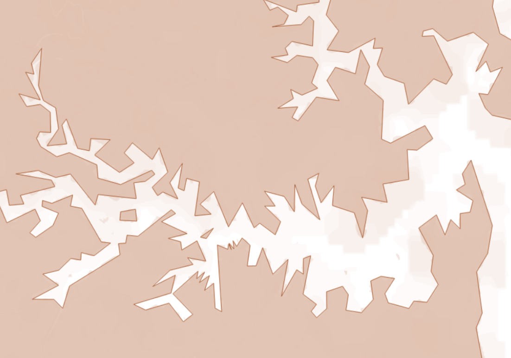

# Reduce size of Shape File

For a map that will be embedded in a high level dashboard that will be viewed at a low resolution, there is no need for great detail on map boarders.  The file size of a shape file can be very large and slow down the performance of the load time of the dashboard.

## Usage

### Dependancies

1. WSL Ubunutu 20.04
1. Python3
    1. geopandas
1. Node.js
    1. mapshaper

## Inspiration

Using [this](https://blog.exploratory.io/how-to-reduce-your-geojson-file-size-smaller-for-better-performance-8fb77759870c) tutorial.  

## Result

  

